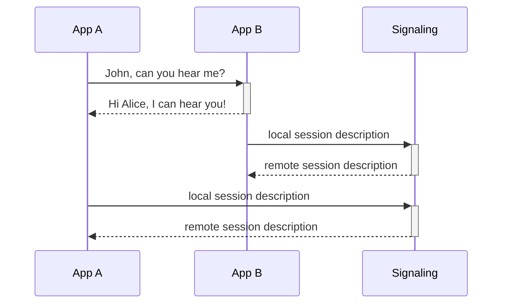

# React-RTC

React real-time communication library.

### Apps and Packages

- [react-rtc](https://github.com/torolocos/react-rtc/tree/main/packages/react-rtc)
- [signaling](https://github.com/torolocos/react-rtc/tree/main/apps/signaling)
- [example](https://github.com/torolocos/react-rtc/tree/main/apps/example)

## About The Project

This project aims to create a simple and versatile [WebRTC](https://webrtc.org/) wrapper in [React](https://reactjs.org/) ecosystem.



## Getting Started

Below are instructions on how to set up this project.

1. Clone this repository

```bash
git clone git@github.com:torolocos/react-rtc.git
```

2. Install all dependencies

```bash
yarn
```

## Usage

Below are instructions on how use this project.

### Build

To build all apps and packages, run the following command:

```shell
yarn run build
```

### Develop

To start development, run the following command:

```shell
yarn run dev
```

### Test

To test all apps and packages, run the following command:

```shell
yarn run text
```

### Publish

To publish all packages, run the following command:

```shell
npm run release
```

> Optional you can provide desired version `major`, `minor` or `patch` or `preRelease` flag with `alpha`, `beta` or `rc`. See: https://github.com/release-it/release-it/blob/master/docs/pre-releases.md

## Licence

Distributed under the MIT License. See `LICENSE` for more information.
