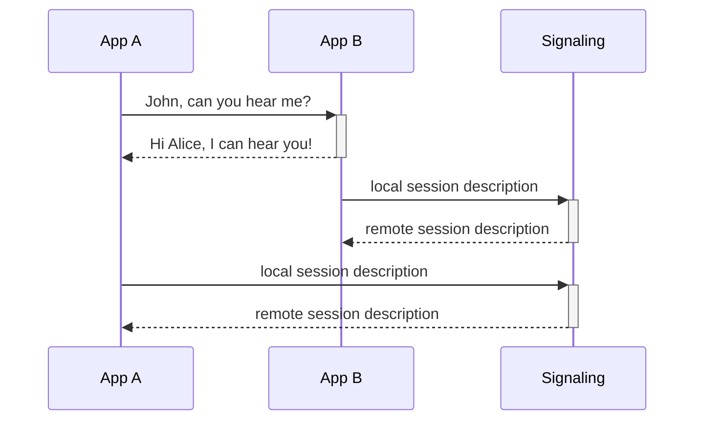

# React-RTC

[React-RTC](https://github.com/torolocos/react-rtc) aims to be a simple and versatile [React](https://reactjs.org/) wrapper around [WebRTC](https://webrtc.org/) technology. This project is open-source, so any contribution would have a warm welcome.

## WebRTC

> See [WebRTC in 100 Seconds](https://www.youtube.com/watch?v=WmR9IMUD_CY)



### Usecases

A quick pick of some projects on [GitHub](https://github.com/topics/webrtc) which are using [WebRTC](https://webrtc.org/):

- Video conference
  - [Google Meet](https://meet.google.com/)
  - [Jitsi Meet](https://github.com/jitsi/jitsi-meet)
- Screen sharing
  - [Deskreen](https://github.com/pavlobu/deskreen)
- File sharing
  - [Snapdrop](https://github.com/RobinLinus/snapdrop)
  - [WebTorrent](https://github.com/webtorrent/webtorrent)

## Tech stack

This project relays on those technologies:

- [WebRTC](https://webrtc.org/)
- [React](https://reactjs.org/)
- [TypeScript](https://www.typescriptlang.org/)
- [Turborepo](https://turborepo.org/) alongside with [Yarn workspaces](https://classic.yarnpkg.com/lang/en/docs/workspaces/)
- Code quality: [Jest](https://jestjs.io/), [ESlint](https://eslint.org/), [Prettier](https://prettier.io/), [Husky](https://typicode.github.io/husky/#/) and [lint-staged](https://github.com/okonet/lint-staged)
- [Release It](https://github.com/release-it/release-it)

## Apps and packages

This monorepo contains:

- [react-rtc](https://github.com/torolocos/react-rtc/tree/main/packages/react-rtc)
- [signaling](https://github.com/torolocos/react-rtc/tree/main/apps/signaling)
- [example](https://github.com/torolocos/react-rtc/tree/main/apps/example)
- [[WIP] web-example](https://github.com/torolocos/react-rtc/tree/main/apps/web-example)

## Usage

1. Run [signaling](https://www.wowza.com/blog/webrtc-signaling-servers) server.

   - To use [WebRTC](https://webrtc.org/) you have to run [signaling](https://www.wowza.com/blog/webrtc-signaling-servers) server. Check out our [implementation](https://github.com/torolocos/react-rtc/tree/main/apps/signaling).

2. Wrap your top-level component with `RtcProvider`.

```tsx
export default () => (
  <RtcProvider
    signalingServer="ws://localhost:8001/"
    iceServers={[{ urls: 'stun:stun.l.google.com:19302' }]}
  >
    <App />
  </RtcProvider>
);
```

3. Use the `useRtc` hook in your components.

```tsx
const { enter, leave, send, on, off } = useRtc();
```

> See the [example](https://github.com/torolocos/react-rtc/tree/main/apps/example) app.

### Events

There is an event-based API. By `on` you subscribe to a certain event and by `off` you unsubscribe. Some of the events contain event detail, see [events detail interface](https://github.com/torolocos/react-rtc/blob/main/packages/react-rtc/src/types.ts#L24-L32).

| Event name       | Description                             |
| ---------------- | --------------------------------------- |
| receive          | when receives a message                 |
| send             | when sends a message                    |
| error            | when an error occurs                    |
| leave            | when the client leaves the network      |
| enter            | when the client enters the network      |
| peerConnected    | when peer connected to the network      |
| peerDisconnected | when peer disconnected from the network |

## Contributors

- [Petr Brantalík](https://github.com/BrantalikP)
- [Petr Chalupa](https://github.com/pchalupa)
